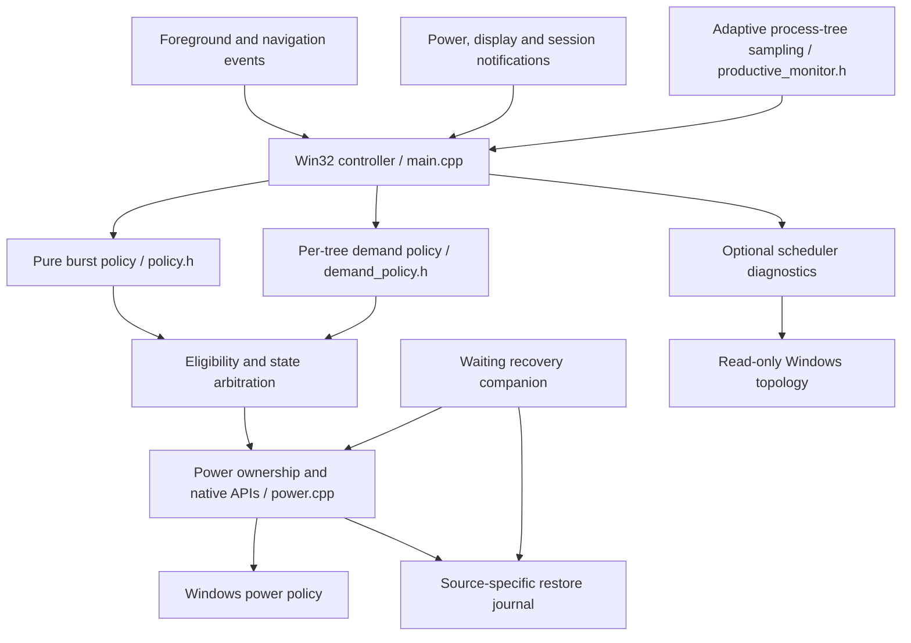

# Architecture

## Responsibility and scope

Pulse is a per-user Win32 process with a tray UI and a second instance of its executable acting as a waiting recovery companion. It requests Windows policy changes; it does not implement a CPU scheduler, frequency governor or hardware power-limit driver. The 1.2 demand preview extends the 1.1.2 publication snapshot. The scheduler guard remains diagnostic and OFF by default.

## State arbitration

Eligibility requires an armed controller and either battery power or the persisted AC opt-in. Display-off, session-lock, suspend and Windows Energy Saver conditions suppress performance requests. Pause releases ownership. Measured productive demand takes priority over a UI burst, retaining Efficient Aggressive instead of switching to Aggressive during a build. Otherwise the controller chooses an accepted Burst, then Efficiency. Keep efficient suppresses both automatic performance paths.

| Policy | Inputs | Entry | Exit / containment |
|---|---|---|---|
| Burst | Foreground/navigation intent; recent input; CPU rise | Accepted event or load edge | Quiet samples, deadline, blocked state or exhausted budget |
| Compute, known tools | Per-tree cached CPU time | At least 65% of one logical processor for 250 ms observed evidence | Below 20% for 500 ms observed quiet, or tree exit |
| Compute, unknown trees | Attributable tree CPU time, session / media / EcoQoS exclusions | At least 80% of one logical processor for 500 ms observed evidence | Same quiet rule |
| Interactive edit | Foreground control/capture or arrow-key intent, followed by fresh CPU evidence | At least 35% of one logical processor in the temporary probe | Below 20% for 125 ms observed quiet, or tree exit |

Evidence durations are evaluated at sample times. Discovery and timer cadence add latency; these thresholds are not end-to-end timing guarantees. Executable-name matching identifies candidates, not proof that a compiler is currently compiling. Known tools still need CPU evidence. Browser/media/voice host exclusions also apply to unknown helpers below those hosts. Shell boundaries end that ancestry exclusion; known compilers remain eligible independently. CPU load cannot establish semantic intent for every unknown application.

The monitor aggregates cached processes into creation-time-checked ancestry groups, including unknown background workers in the current session. Process handles and native sequence numbers protect identity across discovery. Process-exit waits coalesce a message to the controller; all policy evaluation stays on its owner thread. Long-lived hosts use quiet evidence. Very short jobs, service-session workers, inaccessible processes, explicit low-priority/EcoQoS workers and excluded mixed-purpose hosts can be missed.

## Timing and overhead budget

| Condition | Controller timer |
|---|---|
| Active burst | 16–125 ms, bounded by remaining deadline |
| Compute candidate / active compute / newly discovered process | 250 ms |
| Temporary editing probe | 125 ms |
| Ordinary recent interaction | 1 s |
| No recent input for more than 15 s | 3 s |
| Blocked active controller | 10 s |
| Bypassed and hidden in tray | No periodic controller timer |
| Bypassed with visible UI | 1 s |

Non-burst timers allow 100 ms coalescing tolerance. Discovery runs no more frequently than every 3 s without tracked tools, or every 1 s with tracked tools. Full cached-process CPU reads run every 3 s while quiet or 1 s with active evidence. Only hot, candidate, active and interaction targets receive the faster reads. A 1.5 s evidence lease prevents unavailable measurements retaining performance indefinitely. Missing members cannot falsely establish tree quiet. Active control verifies owned settings and guardian health at a 10 s audit interval. Scheduler guard adds no periodic timer.

Bursts have a 3,600 ms budget, consumed during boosting and replenished at 0.20 ms per elapsed non-burst millisecond. A request needs at least 450 ms available; ordinary successive bursts have an 850 ms cooldown. Deadlines are capped at 1,800 ms on DC and 2,400 ms on AC, subject to budget. Quiet detection can end a burst after 375 ms and two low-load samples. Timer delivery and native API latency remain outside these policy bounds.

## Power ownership transaction

1. Resolve required power-mode APIs at runtime and read the active scheme and source modes.
2. Capture supported, explicitly present managed settings for the owned source into a versioned, checksummed journal. Write and flush the temporary journal before replacing the durable journal path.
3. Start the recovery companion and configure the selected source. Write only changed values, commit active-plan changes and read settings back.
4. Apply state changes through boost indices and power-mode APIs. Do not launch `powercfg` for each transition.
5. On pause, source handoff or exit, compare current values with Pulse's recognized values before restoring the snapshot. Preserve distinguishable external choices. Retain the journal on restoration failure.

The compare-and-restore check cannot distinguish another writer choosing exactly the same numeric value as Pulse. This is conflict mitigation, not a multi-writer transaction protocol. The checksum detects accidental corruption; it is not cryptographic authentication. The guardian covers controller termination, not simultaneous system/storage/API failure. Next-launch recovery is best effort after an OS crash.

## Ownership boundaries

| Control | Owner while Pulse is active |
|---|---|
| Windows source power mode and CPU boost | Pulse |
| Minimum active logical cores / minimum processor state | Pulse baseline configuration |
| Standard parking and automatic long/short-thread policy | Pulse baseline configuration |
| Explicit EPP register/value tuning | No Pulse actuator; Windows/OEM policy remains authoritative |
| Fan curves, GPU mode, TDP, Curve Optimizer | G Helper / OEM |
| Per-thread affinity, ideal processor, CPU sets, priorities, QoS | Windows / applications; scheduler guard does not write these |

The baseline scheduling-policy values are distinct from the optional Scheduler guard switch. Turning that switch off does not remove the existing baseline power configuration.

## Source map

- `src/main.cpp`: window procedure, event registration, eligibility, arbitration, tray UI, diagnostics and guardian entry points.
- `src/policy.h`: deterministic responsiveness-burst policy.
- `src/workload.h`: executable categories and legacy compute-policy regression reference.
- `src/demand_policy.h`: current per-tree demand decisions.
- `src/productive_monitor.h`: cached handles, grouping, adaptive accounting, bounded exit waits and editor probes.
- `src/process_discovery.h`: defensive native process-identity discovery with Toolhelp fallback.
- `src/process_monitor.h`: legacy monitor reference; not used by the 1.2 controller.
- `src/power.cpp`, `src/power.h`: snapshot, recovery journal, native writes, readback and restore.
- `src/scheduler_topology.*`: variable-record parsing and read-only topology discovery.
- `src/scheduler_policy.h`: optional diagnostics, conservative cost predicate, preference persistence; no placement actuator.

## Privacy

The controller has no network or telemetry client. It observes process identity, CPU time, foreground transitions and selected navigation key signals. Its decision records do not include typed text, window titles, URLs or audio. Diagnostics may contain machine configuration and local context; users should review reports before sharing them. No personal runtime reports are included in this repository.
