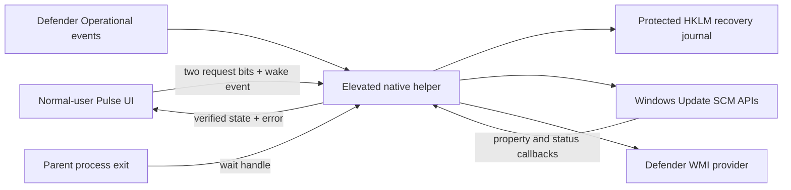

# Efficiency options: event-driven administrative controls

Version: **1.3.0-efficiency-preview**. These optional controls are independent of Pulse's CPU policy. They are OFF by default and apply on both AC and DC while selected. Selections persist in `Pulse.ini` and resume when Pulse next starts; no new automatic opt-in is made for a fresh installation.

## User contract

Open **Efficiency options ▾** in the upper-right corner. Each menu item is independently checkable; both can be selected. A check means **requested**, not successful. The two status lines below the main controls report verified state or failure. The optional one-time broker installation needs administrator approval. After installation, starting or correcting a selection does not request approval again. Portable mode, without that setup, uses one UAC elevation per controller session. Declining elevation leaves system settings unchanged.

| Option | Actuator | Boundary |
|---|---|---|
| Keep Windows Update service off | Service Control Manager: set `wuauserv` startup to Disabled and request STOP | Does not uninstall updates, cancel already-running installers, disable every servicing component or defeat Windows Update Medic |
| Keep Defender real-time protection off | Defender's `MSFT_MpPreference.Set(DisableRealtimeMonitoring=true)` provider; read back preference and `RealTimeProtectionEnabled` | Respects Tamper Protection, organization policy and access restrictions; does not disable the Defender service, protected processes, signatures, cloud protection or unrelated security settings |

Disabling the Update service delays security/quality updates and may affect other update clients. Disabling real-time protection removes normal on-access scanning while it is off. These controls have machine-wide consequences. No battery-runtime or CPU-cost improvement from disabling them has been measured.

**These controls are not unbypassable.** Microsoft documents that protected Defender changes may be ignored even when a management call appears successful. Pulse reports a protected request as blocked; it never reports a successful write as proof of effective protection state. Windows servicing, an administrator or device-management policy can override these settings. Building a competing privileged watchdog or changing protected ACLs would conflict with the bounded-overhead and recoverability requirements.

Uncheck an item to restore its captured baseline. **Restore & exit** requests restoration for both items. Closing the window leaves Pulse and selected controls in the tray. **Pause & restore** refers to CPU power settings only; the separately selected efficiency options remain active. AC connection, display sleep and CPU-work completion do not implicitly change these machine-wide selections.

## Architecture and reasons



### Privilege boundary

The normal controller stays unelevated. `tools/Install-EfficiencyBroker.ps1` installs a protected copy of the executable under Program Files and registers an on-demand, highest-privilege Task Scheduler task for the current interactive user. There is no password storage or periodic task trigger. The task's action cannot be rewritten by the unelevated user, and its binary/directory are writable only by Administrators and SYSTEM. The initiating account can read/run this fixed task. This is an explicitly installed administrative capability, not a UAC bypass.

The client calls `IRegisteredTask::Run` with a random session GUID, parent PID and owner HWND. A shared mapping, ready event and command event admit the initiating user, Administrators and SYSTEM. The helper checks parent image identity (the same image in portable mode, or Pulse.exe for the installed PulseBroker.exe), token-user SID and window ownership. It accepts only two fixed request bits and a stop flag. It accepts no arbitrary service name, command, registry path or script through this channel. Processes under the same user identity are within this local trust boundary; filename checks do not authenticate the publisher. A machine-wide mutex serializes recovery/ownership across sessions. Portable launches fall back to `runas` only if the registered task is absent.

No helper, service subscription, WMI query or periodic efficiency timer is started without a saved selection or outstanding recovery. Once launched, the helper remains asleep between commands/events, including after both options are unchecked; it exits with Pulse. This avoids an exit-versus-new-command race. The optional scheduled task starts only on demand. This patch installs no system service or driver and does not add a new logon trigger for Pulse itself.

### Event subscriptions, not a scan loop

Windows Update uses `SubscribeServiceChangeNotifications` for service properties and status. The API is resolved from the system-directory `sechost.dll`; the SDK declaration has no supplied import library on the tested toolchain. Callbacks only signal an event; SCM calls and recovery run outside the callback.

Defender uses an `EvtSubscribe` subscription for Operational events 5000, 5001, 5007 and 5013. Notifications cause a provider read; only verified divergence can cause a request. Subscription errors become failures. WMI is used directly; there is no resident PowerShell process or repeated subprocess launch. Provider connection/query latency can still be significant; these operations run in the helper, never in Pulse's CPU decision path.

Requests use a two-second reconciliation/verification window to coalesce self-generated events and bursts of notifications. A successful verified state has no periodic polling deadline. A pending SCM transition gets bounded five-second rechecks; after thirty seconds, it changes to an automatic thirty-second retry backoff. Four corrective calls inside a sixty-second window also trigger that backoff; the correction budget resets when the retry resumes. This bounds the rate during a persistent conflict without requiring another user click. API/read/snapshot failures retry after thirty seconds. Tamper Protection remains a distinct blocked state: it performs no write and is reconsidered only on a later configuration notification or selection change. Event-driven observation is not a guarantee of zero callback cost or detection of every possible OS override.

### Durable baseline before mutation

Each option records its own versioned snapshot in the 64-bit machine registry under `HKLM\SOFTWARE\Pulse\EfficiencyOptions`, relying on the normal administrator-only write boundary. A snapshot is flushed before a change and is not overwritten while recovery is outstanding.

- Update: startup type, delayed-auto-start flag and whether it was running. Restore the configuration and request a start if it was previously running. A previously stopped trigger-start service remains free to start after release; Pulse does not keep policing its old running state.
- Defender: the original `DisableRealtimeMonitoring` preference. Restore and read back that preference. Windows still decides effective protection under its policy; this does not promise that an originally-disabled effective state can be re-created after policy changes.

Partial apply failure retains ownership and the recovery record. A failed restore remains visible and retains the journal. Parent-process termination wakes the helper to attempt restoration. New helper sessions recover outstanding baselines before accepting new mutations. Recovery takes priority over a fresh request for the affected option.

The helper itself can crash, the OS can terminate both processes, and a reboot can interrupt restoration. No resident recovery service is installed. At next normal launch Pulse starts the broker for outstanding recovery, even if no selection is saved. Failed restoration remains visible and retries after thirty seconds while the helper runs. Do not delete the records to hide an error. If policy blocks restoration, use the reported error and recorded baseline for administrative recovery. `Pulse.exe --restore` remains the CPU-power journal command and does not elevate to repair these new records. An unexpected helper crash is reported; automatic helper-process restart is not provided in this preview.

## Source map

| File | Responsibility |
|---|---|
| `src/main.cpp` | Dropdown, independent selections, visible status and helper dispatch |
| `src/efficiency.h` | Narrow controller/helper interface |
| `src/efficiency.cpp` | SCM/WMI/event adapters, IPC, elevation, journal and restoration |
| `src/efficiency_policy.h` | Testable reconciliation, ownership and retry limits |
| `tests/efficiency_tests.cpp` | Failure injection without changing the host |

## Verification and explicit limits

Local Windows x64/MSVC Release build, verified September 16–17, 2026: eight native suites passed, including nineteen new failure/ownership assertions; fifteen existing Python analysis tests passed. The GUI test checks initial opt-out and header layout. A separate visible, no-system-writes preview was inspected and its dropdown opened.

The explicit administrator-only Update exercise on the development laptop produced:

```text
applied=1 notification=1 corrected=1 restored=1 operationError=0 restoreError=0 writes=2
```

This exercised the actual SCM adapter and journal: disable, simulate an external startup-type reset, receive notification, correct it, restore baseline and clear recovery. The initial and restored service configuration was manual startup/stopped. It does not prove behavior across Windows feature updates, reboot, every service transition, or every external manager.

On Windows 11 Home 25H2, build 26200.9457, the installed broker transport and saved-selection test also passed from a normal-user process, without another UAC prompt:

```text
applied=1 resumed=1 restored=1 error=0
```

This covered task launch, IPC handshake, verified Update disablement, restoration, a new client session resuming the saved selection, deselection and final restoration. It used a non-visible test owner window, rather than a mouse click on the production menu.

Defender's provider was read successfully under the actual user account. It reported real-time protection already off with Tamper Protection on. The restricted test account received access denied, which is reported as unknown rather than a fabricated state. **The live Defender setter has not been exercised**: its protected-setting refusal, partial-failure ownership and retry behavior are covered by deterministic backend tests. No claim of persistent Defender suppression or resistance to Tamper Protection is made.

No enabled-helper energy benchmark or long-duration conflict stress test has been completed. The absence of a steady-state timer is an architectural property, not a measured battery-life result. The binary is an unsigned preview; hosted-CI status must be evaluated separately from these local checks.

### Reproduction

```powershell
# Standard build and non-mutating tests
python build.py
python -m unittest discover -s tools -p "test_*.py"

# Provider reads only; a restricted account can legitimately return access denied
.\build-native\Pulse.exe --efficiency-diagnose .\efficiency-status.txt

# Isolated visible preview; no live option writes; does not replace the running controller
.\build-native\Pulse.exe --efficiency-preview

# EXPLICIT administrative integration test, not part of CTest:
# briefly changes wuauserv and then restores the recorded baseline.
.\build-native\Pulse.exe --efficiency-exercise .\efficiency-exercise.txt

# One-time administrator setup (run from an elevated PowerShell)
.\tools\Install-EfficiencyBroker.ps1 -SourceExe .\build-native\Pulse.exe

# Normal-user end-to-end test with the installed broker; Update changes are restored
.\build-native\Pulse.exe --efficiency-client-exercise .\broker-exercise.txt
```

Exit Pulse before upgrading the installed broker, and rerun the installer with the new reviewed binary. To remove the optional broker, first uncheck both options, exit Pulse and verify the recovery records are clear. Then an administrator can unregister the task named `Pulse Efficiency <user SID>` and remove its specific `Program Files\Pulse\Efficiency` directory. Do not remove a running broker or discard an outstanding journal.

## Primary references

- [SCM change subscriptions](https://learn.microsoft.com/en-us/windows/win32/services/subscribeservicechangenotifications) and [unsubscribe lifetime](https://learn.microsoft.com/en-us/windows/win32/services/unsubscribeservicechangenotifications).
- [ChangeServiceConfigW](https://learn.microsoft.com/en-us/windows/win32/api/winsvc/nf-winsvc-changeserviceconfigw) and [ControlService](https://learn.microsoft.com/en-us/windows/win32/api/winsvc/nf-winsvc-controlservice).
- [Defender preference Set method](https://learn.microsoft.com/en-us/previous-versions/windows/desktop/defender/set-msft-mppreference).
- [Windows Event Log subscription](https://learn.microsoft.com/en-us/windows/win32/api/winevt/nf-winevt-evtsubscribe).
- [Task Scheduler Run parameters](https://learn.microsoft.com/en-us/windows/win32/api/taskschd/nf-taskschd-iregisteredtask-run) and [task security contexts](https://learn.microsoft.com/en-us/windows/win32/taskschd/security-contexts-for-running-tasks).
- [Microsoft's Tamper Protection troubleshooting guidance](https://learn.microsoft.com/en-us/defender-endpoint/tamper-protection-troubleshoot): protected changes can appear successful while being blocked.

Copyright © 2026 Peter Kosanyi. All rights reserved. See the repository LICENSE and NOTICE.
