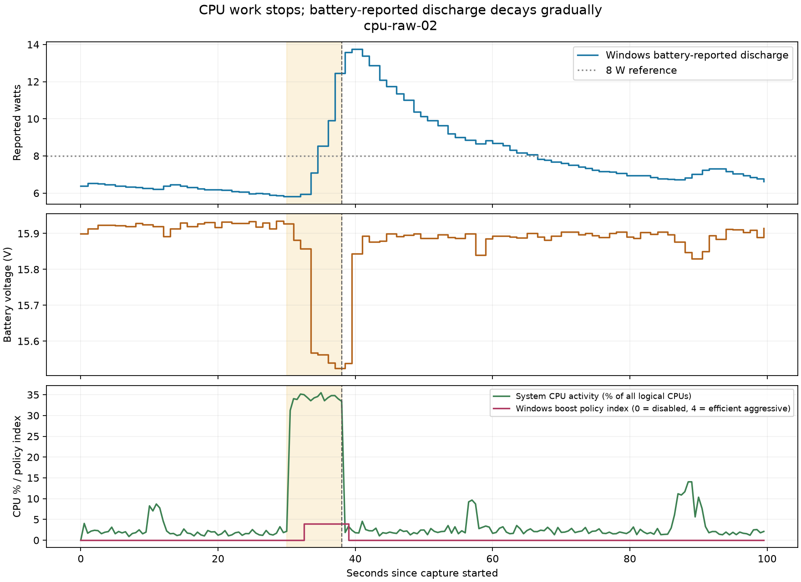

# Evidence index

This index separates implemented behavior, tests, live observations and unverified outcomes. All physical-machine observations concern one ASUS GA605WI / Ryzen AI 9 HX 370. Counts and timings retain their original version scope.

| Claim | Evidence | What remains unproved |
|---|---|---|
| Productive work requests Best performance + boost 4 | [1.2 contract and live observations](../productive-demand-patch.md), `tests/demand_tests.cpp` | Universal compiler/editor coverage; energy advantage of boost 4 |
| Unknown process trees can qualify | Unlisted Python compilation and behavioral policy tests | Semantic intent of every unknown process; service/inaccessible work |
| Editing intent requires CPU evidence | Darktable isolated local-contrast drags and policy tests | DaVinci Resolve; GPU-only demand; paired edit latency/energy benefit |
| Default DC ownership, optional AC, restoration | [Historical source-transition and recovery checks](../validation.md) | Complete regression coverage on every later patch or device |
| Small settled controller cost | 40.067 s 1.2 observation: 46.875 ms CPU, 2.67 MiB private memory | Long-run energy cost, wakeup distribution, battery-runtime benefit |
| Defensive native/shared parsing | Seven local native CTest entries | Exhaustive malformed-input/security audit; live HWiNFO protocol validation |
| Offline comparison rejects invalid evidence | Fifteen Python tests across two modules | Ground-truth package or whole-laptop energy |
| Boost release precedes battery-reported recovery | Two sanitized captures below | Sole physical cause of the tail; component power; saved joules |
| Hosted automation configured | [Windows workflow](../../.github/workflows/windows.yml) | Hosted success: account execution restriction has prevented job steps |

## Reproducible battery traces — September 9

| Run | Workers / load | Boost Disabled after completion | Reported rate below 8 W |
|---|---|---:|---:|
| [cpu-raw-01](2026-09-09/cpu-raw-01/samples.csv) | 4 / approximately 8 s | 0.997 s | 15.999 s |
| [cpu-raw-02](2026-09-09/cpu-raw-02/samples.csv) | 8 / approximately 8 s | 0.995 s | 28.505 s |

Each run is 100 seconds with a 30-second baseline and 500 ms requested sampling. “Below 8 W” requires approximately three seconds of following valid samples. Query latency, background activity and sample resolution limit interpretation. HWiNFO frames were unavailable in both runs. See the [full investigation and fit method](../power-tail-investigation.md).



[Four-worker figure](2026-09-09/cpu-raw-01/tail.png). The dashed vertical line is workload completion; the shaded region is the synthetic workload. The curves are battery-reported watts, reported voltage, total CPU busy time and boost policy index. None is an independent whole-system wattmeter.

### Reproduce the analysis

From the repository root, using Python 3.10+:

```powershell
python tools/verify_published_evidence.py
python tools/analyze_tail.py docs/evidence/2026-09-09/cpu-raw-01
python tools/analyze_tail.py docs/evidence/2026-09-09/cpu-raw-02
```

The verifier recomputes both JSON summaries in temporary directories and compares them with the published values. It requires no hardware or third-party packages. `--plot` on the analyzer additionally requires Matplotlib and regenerates the figure. [Acquisition source](../../tools/tail_probe.cpp), [analysis](../../tools/analyze_tail.py), [component comparison](../../tools/component_tail.py).

### Provenance and minimization

The runs used installed Pulse 1.2.0-demand-preview and the initial PulseTailProbe 0.1 acquisition code. Analysis includes the later gap/error-window checks, which preserved the results. Recorder 0.2 adds a required-sensor startup check; these older runs do not validate that live component path.

Published CSVs are column-selected exports of the original captures, not generated measurements. They retain relative timestamps and numerical evidence used by the analyzer. Wall-clock timestamps, input ages, device tags, power-plan IDs and full sensor catalogs are omitted. Metadata retains acquisition interval, workload size, error counts and measured recorder cost. Original private captures remain local. The plots depict the same numeric samples.

## Acceptance gates

No assertion count replaces a completed real workload. No latency observation establishes a percentile. No CPU-time observation establishes watt-hours. Component availability/freshness and physical enforcement must be verified before a hardware-control experiment. A runtime claim requires repeated, matched, equal-work trials under the [planned protocol](../benchmark-plan.md).
