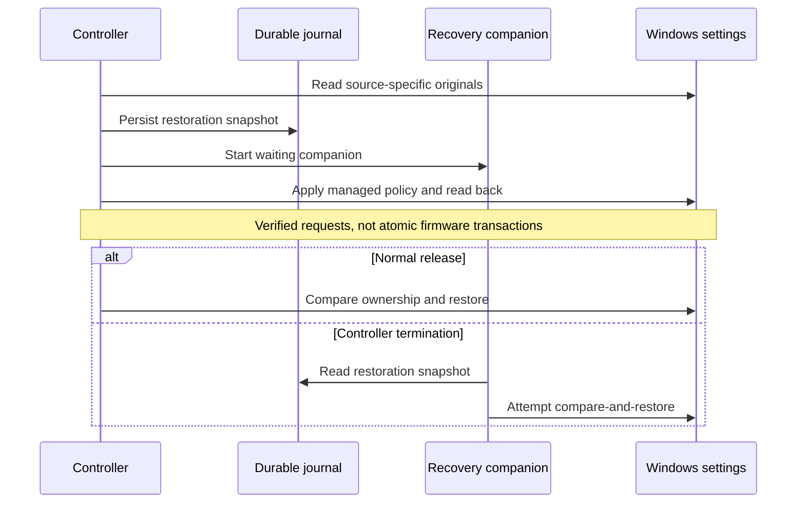

# Failure handling and ownership limits

The controller can write managed Windows settings; the recorder cannot. Hardware limits, fans, GPU mode and Curve Optimizer remain outside Pulse's actuator boundary.

| Condition | Implemented behavior | Limit / review point |
|---|---|---|
| Pause or AC bypass | Release owned source settings; stop ordinary active monitoring | G Helper's global Windows-mode handoff is not automatically reversed per charger event |
| Known tool open but idle | Require CPU-time evidence before Compute | Executable identity is candidate information only |
| Persistent host finishes internal work | Release through observed quiet | No universal task-complete event; sampling adds latency |
| Parent exits while children continue | Account for surviving tracked tree members | Discovery/access limits can leave unobserved work |
| Process ID reused | Check identity/creation time and native sequence where available | Fallback capabilities differ across Windows versions |
| Process unavailable or access denied | Bounded cache, denial backoff and evidence expiry | Missing evidence does not prove idle |
| Overlapping productive trees | Decide per tree, aggregate before final state choice | Unrelated media must not impose a global veto on a compiler |
| Power API/readback failure | Report fault and retain restoration information as applicable | Software acceptance cannot guarantee physical enforcement |
| Outside writer changes settings | Compare before restore; preserve distinguishable external choices | Identical values are indistinguishable; no cross-application atomic transaction |
| Controller terminates | Waiting companion attempts journal recovery | Not protection from simultaneous OS, storage or companion failure |
| OS crash/interrupted recovery | Best-effort recovery on a later launch | Requires an intact journal and functioning APIs |
| HWiNFO absent | Mark missing readings; required-sensor capture refuses startup | Battery-only data cannot establish package recovery |
| Shared writer busy/malformed data | Skip/reject snapshot; bounded parser checks | Synthetic tests do not replace live producer validation |
| Stale/gapped component evidence | Offline comparison rejects insufficient evidence | No interpolation invents rapid recovery |

## Recovery sequence

The journal checksum detects accidental corruption, not malicious same-user changes. Pulse is not a security boundary against other software running as that user. Direct hardware control and thread placement are not hidden fallback paths when Windows policy is insufficient.

There is no claim of exhaustive fault injection. Restore tests, source transitions and forced-exit observations are dated in [validation](validation.md); scenarios not rerun for 1.2 remain outstanding. Dynamic hardware limits need their own single-owner lease, partial-write handling, readback and crash/source-loss restoration. [SMU evaluation](smu-cap-evaluation.md).
